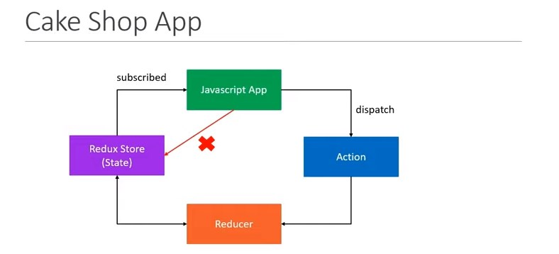
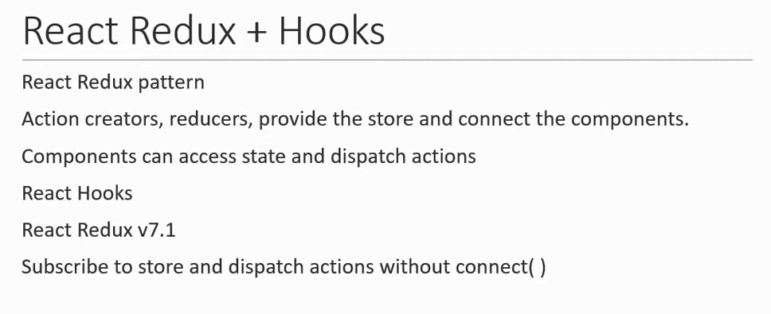
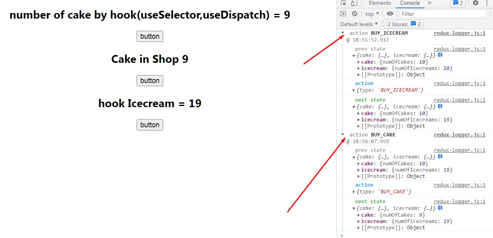
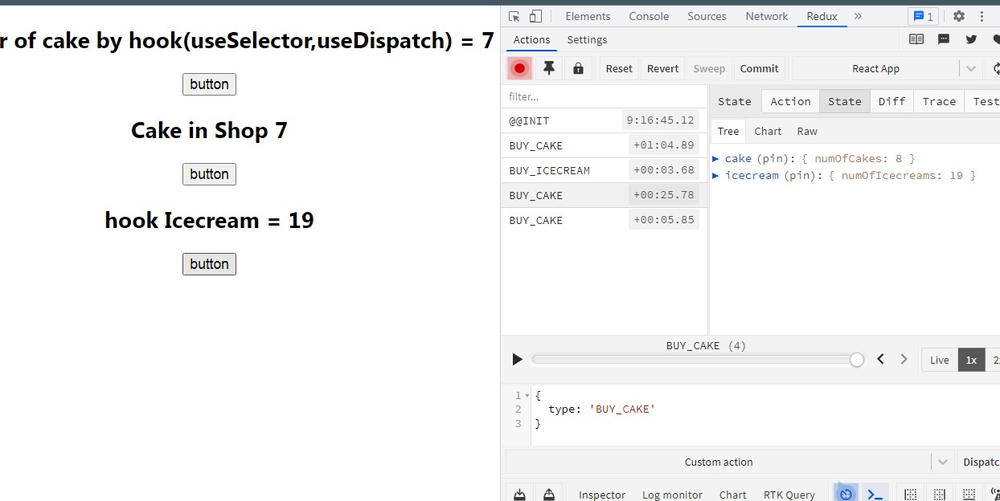
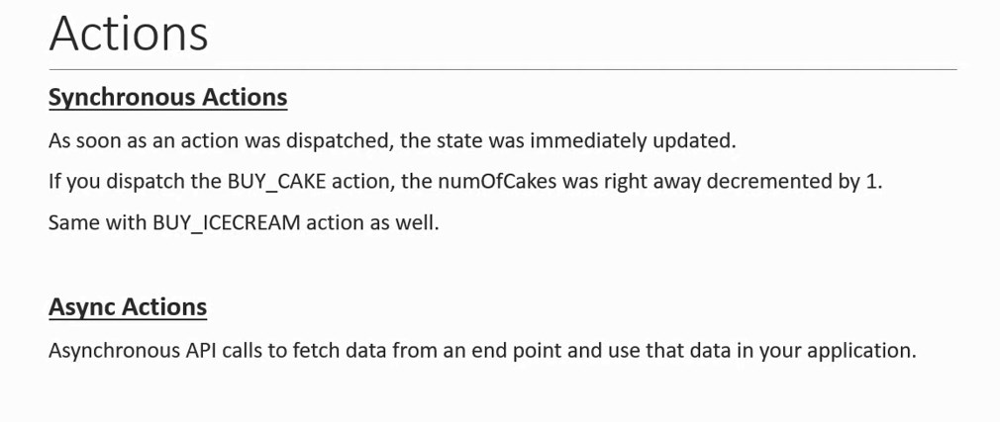
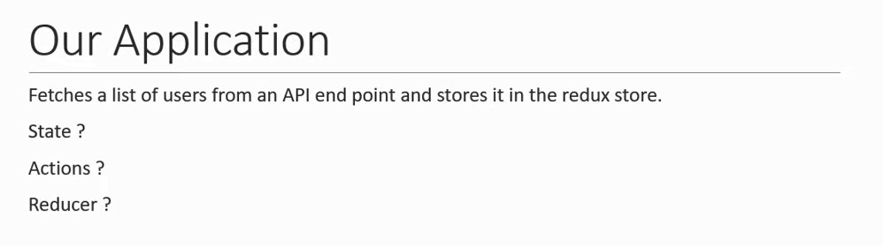
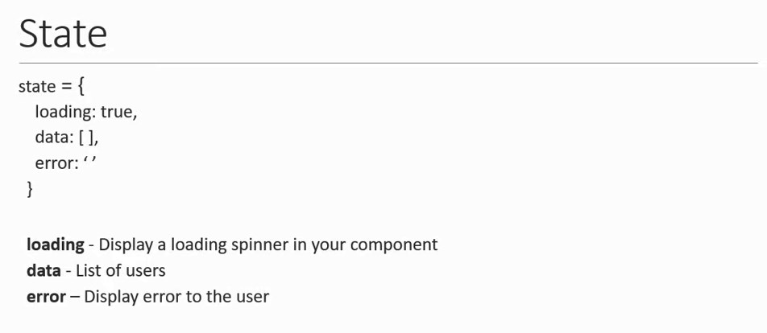
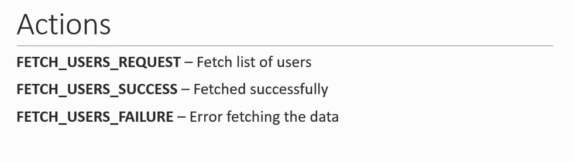
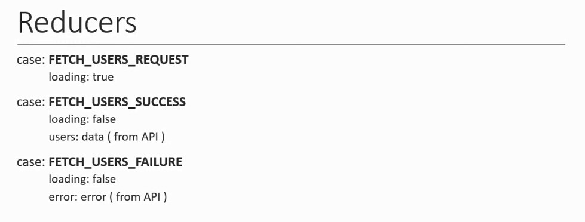

# React Redux + Hook

### `npx create-react-app name`
### `yarn add redux react-redux`
### `yarn add redux-logger`
(for log information)

## Logger output

## Redux Dev tool extension install
### `npm install --save @redux-devtools/extension`

## Extension output

# Async

