# JS + React + Redux + Hook

Redux: Redux is a predictable state container for javascript apps.

### `npm init –-yes` = default
### `yarn add redux` = install redux

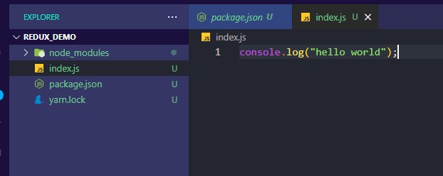

### `node index.js`

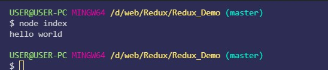

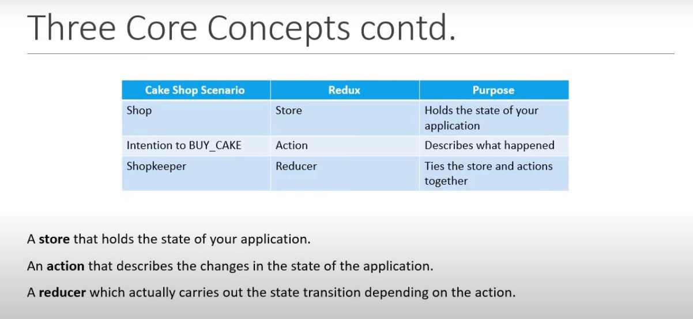
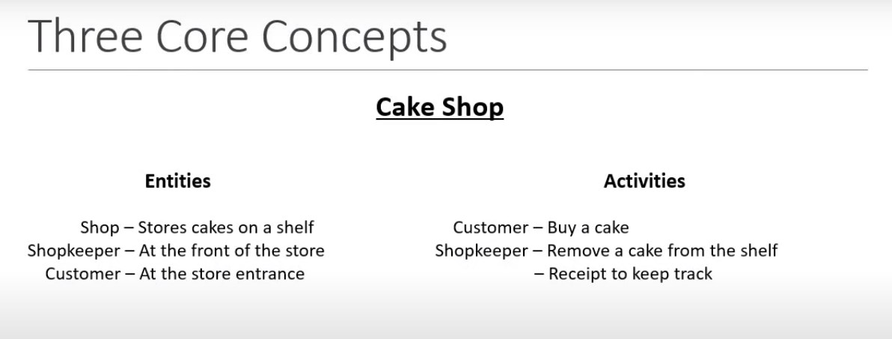
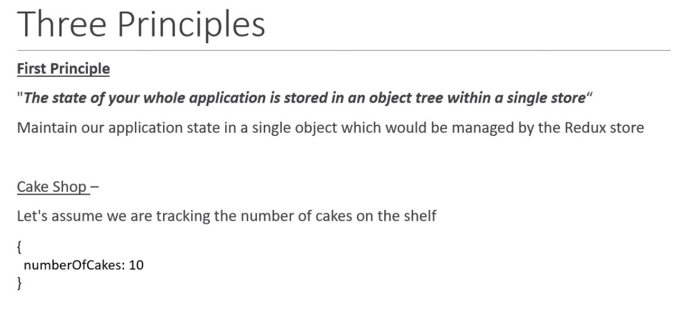
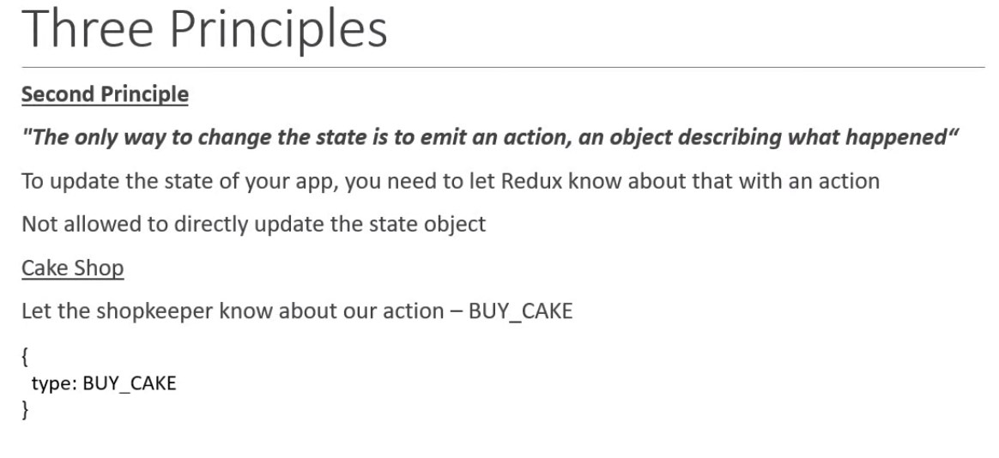
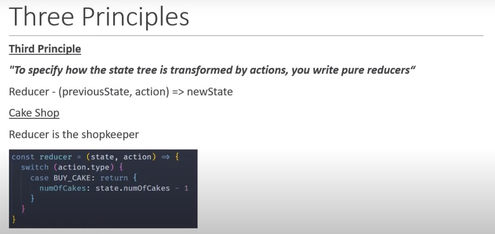
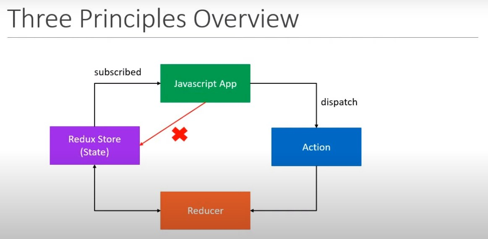
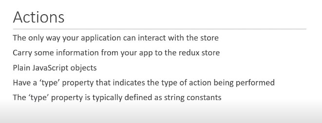
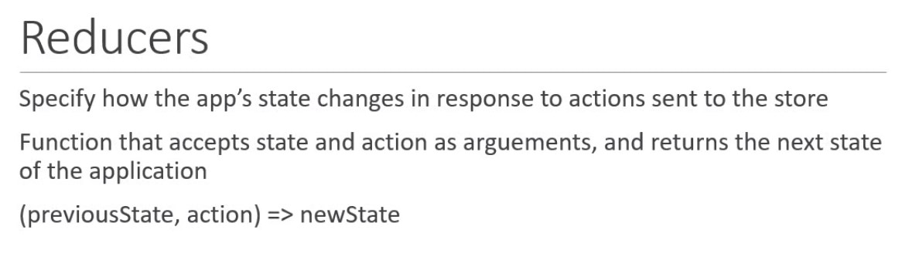
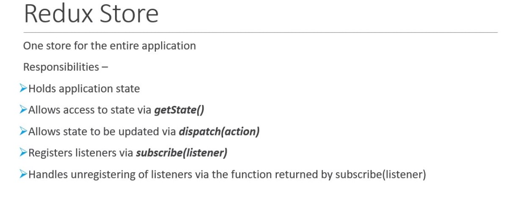

## Multiple Reducer

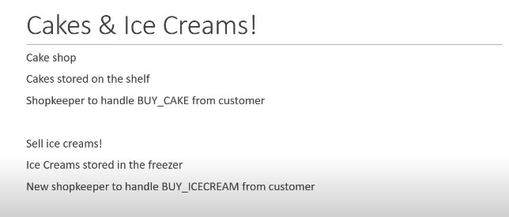
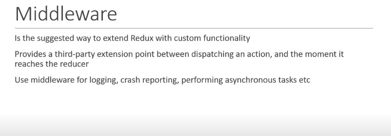

### `yarn add redux-logger` = middleware.

## Async Action
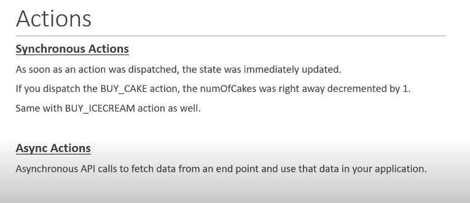
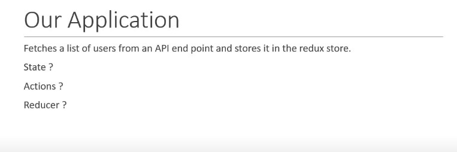
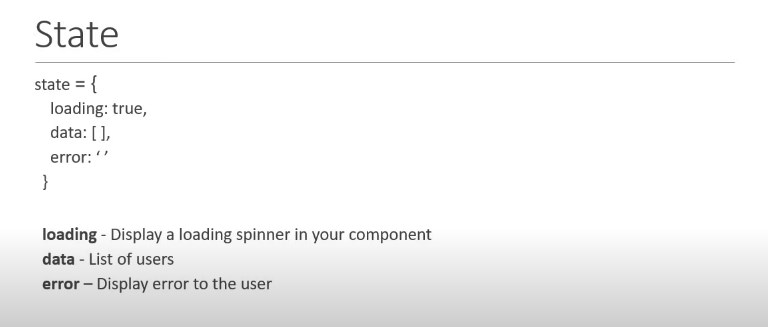
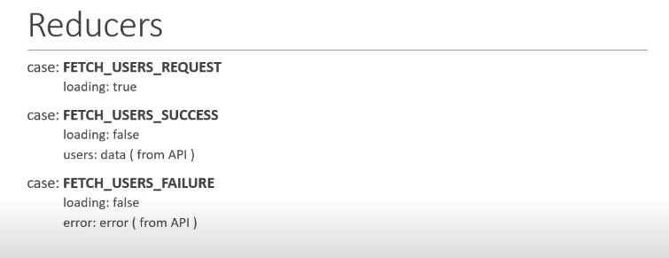
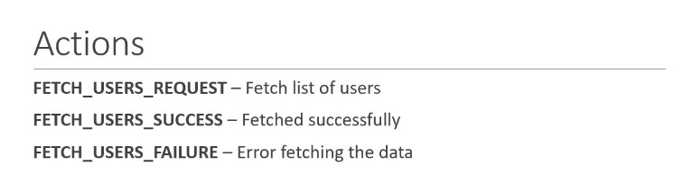

## Redux thunk middleware:

### `yarn add axios redux-thunk`

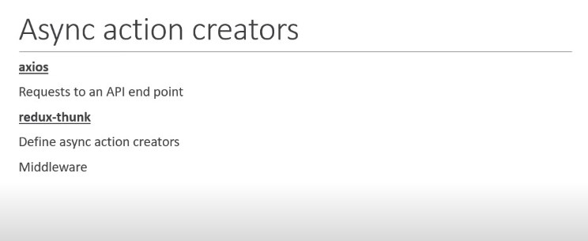
